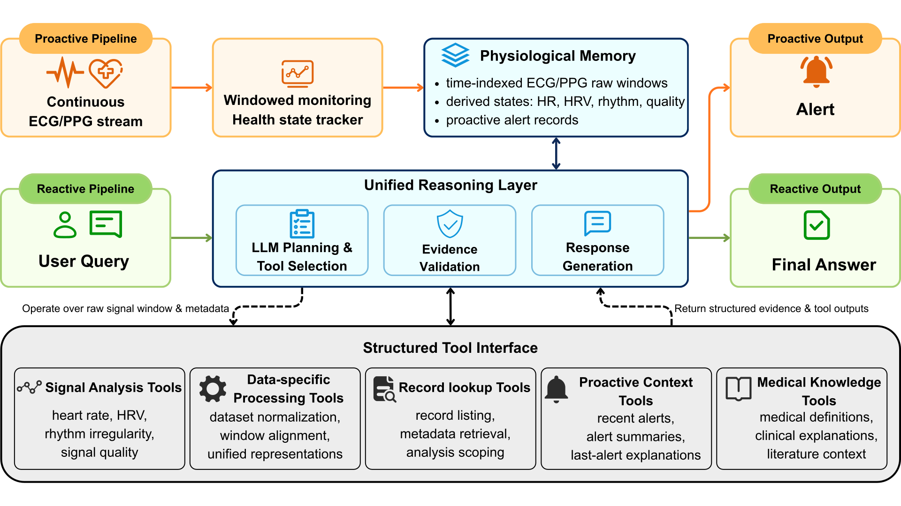

# VitalAgent: A Tool-Augmented Agent for Reactive and Proactive Physiological Monitoring over Wearable Health Data

[**Project Page**](https://dksezd.github.io/VitalAgent/) | [**Paper**](https://arxiv.org/abs/2605.29483) | [**Benchmark**](agent/benchmarks/vitalbench/README.md)

Official implementation of the paper *"VitalAgent: A Tool-Augmented Agent for Reactive and Proactive Physiological Monitoring over Wearable Health Data"*.

**VitalAgent** is a tool-augmented ECG/PPG agent that operates directly on raw
physiological signals for reactive health question answering and proactive
monitoring. This repository also includes **VitalBench**, the benchmark and
evaluation pipeline used for longitudinal physiological monitoring.

<p align="center">
  
</p>

VitalAgent has two engines:

- **Reactive engine** (query-driven): `Planner → Tools → Validation gate → LLM agent`,
  with a re-plan loop. Answers questions about a recording window by
  dynamically invoking raw-signal analysis and state-grounded tools, then
  synthesizing a grounded answer.
- **Proactive engine** (signal-driven): streams long-term recordings
  window-by-window, maintains physiological context, applies deterministic
  **rule** checks and a guideline-grounded **LLM judge** on flagged windows,
  and emits intervention events.

## Repository layout

```
agent/
  reactive/        Reactive pipeline: planner, validation, LLM agent, replan
  proactive/       Proactive pipeline: tracker, rule layer, LLM judge
  tools/           Modality-aware tool registry (ECG / PPG / dataset / state tools)
  benchmarks/
    vitalbench/    VitalBench construction (templates, state→QA generator, eval loader)
  evaluation/
    reactive/      VitalBench reactive evaluation harness
    proactive/     Proactive monitoring evaluation harness
  mhealth/         MonitoringState schema + per-dataset state builders
  data/            Dataset loaders
  encoder/         Signal processors + ECGFounder runtime
  llm/             Shared OpenAI-compatible LLM client
  demo/, web_demo.py, chat_ui/   Live web demo (HTTP server + frontend)
scripts/vitalbench/   Benchmark build/generate scripts
dataset/vitalbench/   The released VitalBench benchmark (qa/states + dev/test split)
docs/                 Static project page with pre-recorded demo traces
tests/                Unit test suite
```

## Installation

Requires Python ≥ 3.10 and [uv](https://docs.astral.sh/uv/).

```bash
uv sync                 # runtime dependencies
uv sync --extra dev     # + pytest / ruff (for running tests)
```

Copy the environment template and fill in your values:

```bash
cp .env.example .env
```

Key settings (see `.env.example` for the full list):

- `OPENAI_API_KEY` / `OPENAI_BASE_URL` / `LLM_MODEL` — any OpenAI-compatible API
  (the template is configured for DeepSeek; per-role overrides exist for the
  agent / planner / proactive judge).
- `DATASET_{ICENTIA11K,AFPPGECG,PPG_DALIA,WESAD}_ROOT` — local paths to the raw
  datasets (not shipped here; see [Data sources](#data-sources)).
- `DATASET_VITALBENCH_ROOT` — the benchmark the evaluator reads
  (default `./dataset/vitalbench/final`, which ships with the repo).

The ECGFounder-backed ECG diagnosis tool needs the ECGFounder model under
`external/ECGFounder` (auto-cloned/downloaded on first use, or place it
manually). It is only required for ECG diagnosis questions.

## Usage

Three console entry points are installed by `uv sync`:

### Web demo

```bash
uv run vitalagent-web-demo          # serves http://127.0.0.1:7860
```

Then open `http://127.0.0.1:7860`, start a live session, and watch the proactive
engine stream windows (HR / rhythm / intervention flags) while you ask the
reactive agent questions about the current window.

The UI defaults are set for an Icentia11k demo patient (`01182`, segments
`00,01`). If you are only using the bundled tiny sample included in this repo,
enter patient `00012` and segment `00` in the UI, or point
`DATASET_ICENTIA11K_ROOT` at a local Icentia11k mirror. Missing local records may
be fetched from PhysioNet by the loader.

### Reactive evaluation (VitalBench)

```bash
uv run vitalbench-eval --conditions agent --tier A --max-samples 50 \
    --output-dir ./out
```

Reactive conditions: `agent`, `agent_no_validation`, `agent_no_replan`,
`agent_no_planner`.
The evaluator uses raw-signal mode by default. Add `--dataset <name>` to filter
to one dataset, and run `uv run vitalbench-eval --help` for all options.

### Proactive evaluation

```bash
uv run vitalagent-proactive-eval --dataset icentia11k --output-dir ./out
```

Sweeps every patient in the chosen dataset (`icentia11k` or `afppgecg`), writing
a per-patient report JSON plus a combined `multi_patient_summary.csv` under
`--output-dir`. Pass `--patient-id <id>` to evaluate a single patient, add
`--llm-mode live` to force the LLM judge on (the default `env` mode follows
`LLM_PROACTIVE_ENABLED`), and run `uv run vitalagent-proactive-eval --help` for
all options.

## VitalBench

The released benchmark lives at `dataset/vitalbench/final/` (QA + grounding
states, with a dev/test split). To rebuild it from raw signals, or for the full
template taxonomy, schema, and reproducibility notes, see
[agent/benchmarks/vitalbench/README.md](agent/benchmarks/vitalbench/README.md).

## Data sources

Raw recordings are **not** redistributed here — download each from its host and
point the matching environment variable at your local copy.

| Name | Modality | Host | Env var |
|------|----------|------|---------|
| `icentia11k` | single-lead ECG | [PhysioNet](https://physionet.org/content/icentia11k-continuous-ecg/1.0/)  | `DATASET_ICENTIA11K_ROOT` |
| `afppgecg` | finger PPG + ECG reference | [Zenodo](https://zenodo.org/records/11242869) | `DATASET_AFPPGECG_ROOT` |
| `ppg_dalia` | wrist BVP field study | [UCI / PPG-DaLiA](https://archive.ics.uci.edu/dataset/495/ppg+dalia) | `DATASET_PPG_DALIA_ROOT` |
| `wesad` | chest/wrist wearable | [WESAD](https://archive.ics.uci.edu/dataset/465/wesad+wearable+stress+and+affect+detection) | `DATASET_WESAD_ROOT` |

## Citation

```bibtex
@misc{zhu2026vitalagenttoolaugmentedagentreactive,
      title={VitalAgent: A Tool-Augmented Agent for Reactive and Proactive Physiological Monitoring over Wearable Health Data},
      author={Di Zhu and Yu Yvonne Wu and Hong Jia and Aaqib Saeed and Vassilis Kostakos and Ting Dang},
      year={2026},
      eprint={2605.29483},
      archivePrefix={arXiv},
      primaryClass={cs.AI},
      url={https://arxiv.org/abs/2605.29483},
}
```
